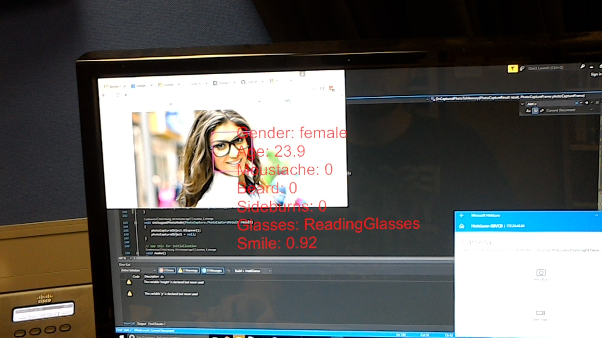

# hololens_facial_recognition
Facial recognition for the Microsoft Hololens. You'd need the Hololens version of Unity to build it.  

Air tap or click with the clicker to take a photo/post it to the Face API  
  
Copy config.cfg.example to config.cfg and edit it, replacing my API keys with your own  
You can get API keys from https://www.microsoft.com/cognitive-services/en-us/subscriptions  

Interfacing with https://hub.docker.com/r/uoacer/openface-mass-compare/ for individual recognition is optional  

